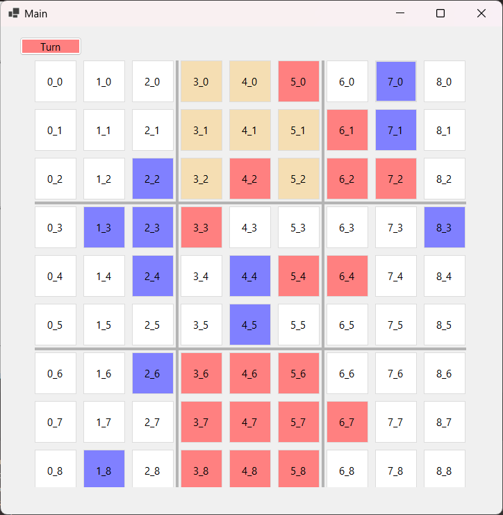

# Super tic-tac-toe Game (Work in Progress)

This is a markdown file for the Super Tic Tac Toe game project that is currently under development.

## Description

Super tic-tac-toe is an advanced version of the classic tic-tac-toe game, played on a 3x3 grid of smaller tic-tac-toe boards. Each move determines the position on the smaller board, influencing the larger game. Beat your opponent by winning three smaller boards in a row, adding depth and strategy to the familiar game of tic-tac-toe.

## Features (Planned)

- Interactive gameplay on a visually appealing game board.
- Multiplayer mode: Play against a friend on the same device.
- Single-player mode: Challenge the computer AI with adjustable difficulty levels.
- Game statistics: Keep track of wins, losses, and ties.
- Undo moves: Allow players to undo their previous moves.
- Sound effects: Enhance the gaming experience with sound effects.

## Current Status

Completed features:

- Check win for each small Tic Tac Toe board.
- Gameplay for two players on the same device.

In progress:

- Checking the remaining unmarked large Tic Tac Toe boards to determine the win condition for the big board.

## Technologies Used

- Programming language: C#
- Framework: .NET WinForms

## Screenshot

<i>Game</i>

## Gameplay Instructions

- Blue is the blue player's mark.
- Red is the red player's mark.
- Yellow indicates where the next mark can be placed.
- When a player wins a small Tic Tac Toe board, that entire board changes to the winner's mark.

## Installation

1. Clone the repository: `git clone https://github.com/dangphuc2470/SuperTicTacToe.git`
2. Open the solution file `SuperTicTacToe.sln` in Visual Studio.
3. Build the solution to compile the project.
4. Run the application from Visual Studio or locate the executable file in the output directory.
   
## Usage

(Work in Progress)

## Contributing

Contributions are welcome! If you have any suggestions, bug reports, or feature requests, please open an issue or submit a pull request.

## License

This project is licensed under the [MIT License](LICENSE).

Please note that this markdown file is subject to change as the project progresses. Check back for updates!
